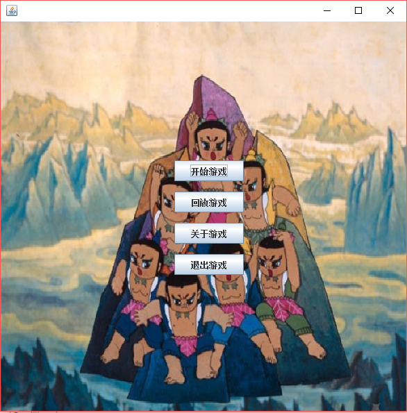
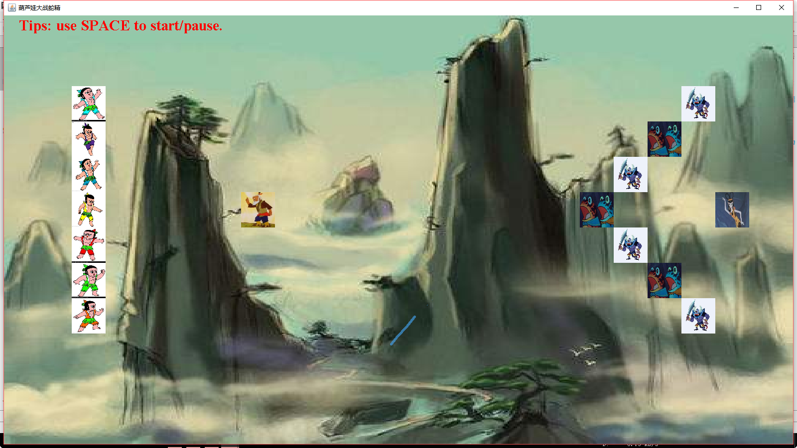
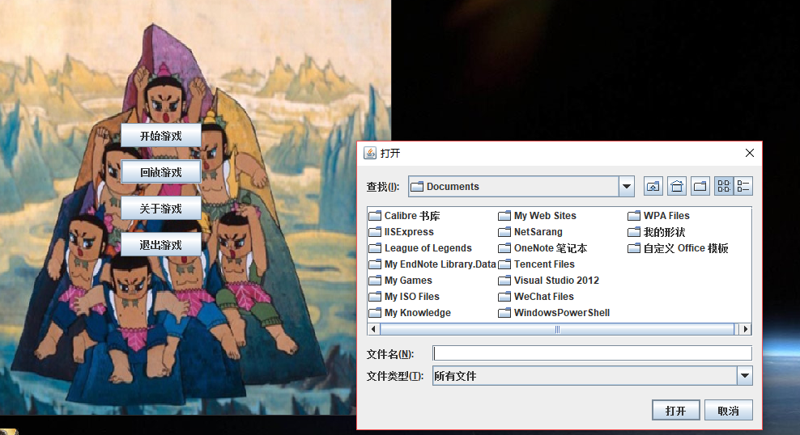
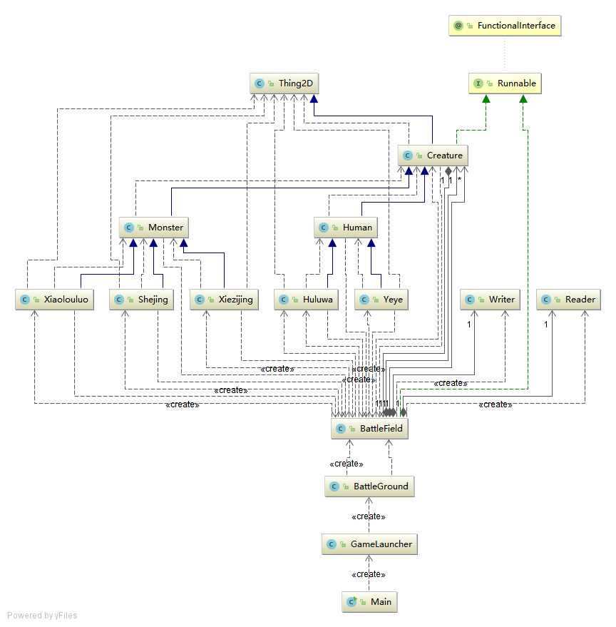

## 葫芦娃大战蛇精

> 这是一个葫芦娃和爷爷对抗妖怪们的游戏，游戏很简单，只要我们初始化开始的游戏布局，就可以观看
> 他们的精彩对战了，每当葫芦娃与妖怪相遇时，他们当中一人便会随机有一人死亡，活着的葫芦娃会
> 继续寻找其他妖怪，直到某一方全部死亡，游戏结束。
> 另外， 游戏也支持回放功能，之前的每一次游戏历史都被纪录下来了，我们任何时候都可以重现
> 当时精彩的战斗画面。

### 怎样运行

这是一个Java maven工程，命令行界面下，进入工程目录，先执行`mvn package`，会在target目录下生成
一个WarOfHS.jar文件，然后执行`java -jar WarOfHS`即可运行

或者也可以直接用IntelliJ IDEA导入工程，然后直接编译运行即可。

### 游戏操作
游戏的主界面如下

它有四个按钮组成，用鼠标点击对应按钮即可响应。
点击**开始游戏**按钮，会进入游戏界面

在此界面下，用SPACE键控制游戏的开始与暂停。
点击**回放游戏**按钮，对自动弹出一个文件选择对话框

选择对应的历史文件即可回放游戏。

### 程序结构说明

* Thing2D: 二维坐标 + image 
* Creature: 一切生物的抽象，所有生物的行走模式(go()方法和move方法)是在此实现的
* Human: 代表正义一派的葫芦娃和爷爷
* Monster: 代表妖怪帮派，这两个类的抽象是为了从某一个具体的生物得到它的敌人集合(getEnamy()方法)
* Huluwa, Yeye, Shejing, Xiezijing, Xiaolouluo: 各种生物, 每种生物都有各自的image
* Writer: 用来记录游戏, 每次可以写入一个字符串
* Reader: 回放游戏需要用它读文件，每次可以从文件读取一行
* GameLauncher: 游戏启动界面的绘制和控制
* BattleField：游戏战斗和回放界面的绘制和控制

### 关于回放机制的实现
一开始我的实现思路是记录每个creature在每个时刻的运动情况，回放的时候按时刻对所有creature重现这些运动即可，
但是感觉这样实现起来太麻烦，有很多和线程相关的操作，我也不太熟悉。
后来想到一种简单的实现思路，就像录视频一样，我不关心每个时刻每个creature有什么操作，我只要记录下每个时刻
屏幕上哪个位置有什么creature，然后回放的时候重现即可，这样实现起来简单很多。

### 最后...
由于时间比较紧急，程序还是有很多bug的，还请见谅。。。

感谢两位老师的辛勤上课，作为快毕业的老生，非常希望老师给个及格啊，这样明年就可以去安心实习了。

